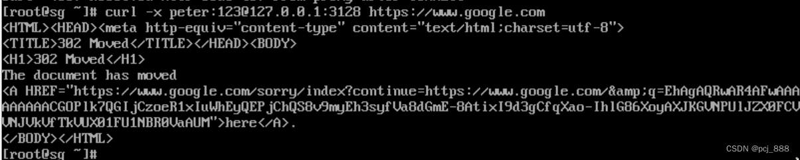

## 前言

通过阅读Redis源码，配合GDB和抓包等调试手段，分析Redis发布订阅的实现原理，思考相关问题。

**源码版本：**[Redis 6.0.10](https://github.com/redis/redis/releases/tag/6.0.10)


## 思考问题

* [发布订阅基本概念介绍](#jump0)
* [订阅频道 —— SUBSCRIBE命令的实现](#jump1)
* [退订频道 —— USUBSCRIBE命令的实现](#jump2)
* [订阅模式 —— PSUBSCRIBE命令的实现](#jump3)
* [退订模式 —— PUNSUBSCRIBE命令的实现](#jump4)
* [发送消息 —— PUBLISH命令的实现](#jump5)
  * [Redis发布订阅的特点](#jump6)
  * [为什么设计pubsub_patterns_dict字典？](#jump7)
* [一次完整的Redis订阅、发布流程分析](#jump10)
  * [为什么redis-cli中执行了subscribe命令后无法再执行unsubscribe命令？](#jump11)
  * [TCP是没有消息边界的，订阅者是如何保证正确解析发布者的消息?](#jump12)
  * [订阅的客户端断线，服务端是怎么感知的？如何保证这个客户端的频道、模式订阅信息也被同步删除？](#jump8)
  * [服务器正常关闭场景，正在订阅的客户端是怎么感知到服务器离线的？](#jump9)
* 查看订阅消息

<!-- more -->

### 发布订阅基本概念介绍<span id="jump0"></span>

Redis的发布订阅功能由SUBSCRIBE，PSUBSCRIBE，PUBLISH等命令组成，每个命令对应的功能和相关源码参考下表：

| 命令         | 功能                     | 相关源码            |
| :------------ | :------------------------ | :------------------- |
| subscribe    | 订阅一个或多个频道       | subscribeCommand    |
| unsubscribe  | 解除一个或多个频道的订阅 | unsubscribeCommand  |
| psubscribe   | 订阅一个或多个模式       | psubscribeCommand   |
| punsubscribe | 解除一个或多个模式的订阅 | punsubscribeCommand |
| publish      | 发送信息到指定频道       | pubsubCommand       |
| pubsub       | 查看订阅信息             | pubsubCommand       |

Redis发布订阅的示例可参考[菜鸟教程 Redis 发布订阅](https://www.runoob.com/redis/redis-pub-sub.html)

### 订阅频道 —— SUBSCRIBE命令的实现<span id="jump1"></span>

客户端向Redis服务器发送SUBSCRIBE命令，Redis服务器收到客户端的订阅请求，将频道的订阅关系保存在字典`pubsub_channels`中，数据结构如下：

```c
struct redisServer server;	/* Server global state, server.c */
struct redisServer { // server.h
	dict *pubsub_channels;  /* Map channels to list of subscribed clients */
};
```

`pubsub_channels`字典的键表示频道，为字符串类型，字典的值为一个链表，保存所有订阅了这个频道的客户端。

每当一个客户端执行`SUBSCRIBE channel`命令后，服务端将执行如下操作：

* 如果`pubsub_channel`字典不包含`channel`这个键，说明<font color = 'blue'>此时这个频道还没有任何订阅者</font>，此时服务端将首先在字典中创建一个叫`channel`的键，值初始成一个空链表，然后将这个客户端加入空链表。
* 如果`pubsub_channel`字典包含`channel`这个键，说明<font color = 'blue'>此时这个频道已经有1个或多个订阅者</font>，此时服务端在字典中找到这个键对应的链表，再将这个客户端加入链表末尾。

举例：有4个客户端(client1~client4)，其中client1, client2订阅`channel1`, client3, client4订阅`channel2`，此时，`pubsub_channels`字典可以是下图所示：


##### [GDB打印频道字典`pubsub_channels`的方法](#jumpx)

订阅频道的源码实现参考`pubsub.c/subscribeCommand`

```c
void subscribeCommand(client *c) {
    int j;
    for (j = 1; j < c->argc; j++)
        pubsubSubscribeChannel(c,c->argv[j]);
    c->flags |= CLIENT_PUBSUB;
}

/* Subscribe a client to a channel. Returns 1 if the operation succeeded, or
 * 0 if the client was already subscribed to that channel. */
int pubsubSubscribeChannel(client *c, robj *channel) {
    dictEntry *de;
    list *clients = NULL;
    int retval = 0;

    if (dictAdd(c->pubsub_channels,channel,NULL) == DICT_OK) {
        retval = 1;
        incrRefCount(channel);
        /* Add the client to the channel -> list of clients hash table */
        de = dictFind(server.pubsub_channels,channel);
        if (de == NULL) { // 说明channel还没有任何订阅者，需先在字典中新增channel键，再初始化1个链表，并将客户端加入链表
            clients = listCreate();
            dictAdd(server.pubsub_channels,channel,clients);
            incrRefCount(channel);
        } else { // 说明channel已有1个或多个订阅者，直接将这个客户端加入链表即可
            clients = dictGetVal(de);
        }
        listAddNodeTail(clients,c);
    }
    /* Notify the client */
    addReplyPubsubSubscribed(c,channel);
    return retval;
}
```


### 退订频道 —— USUBSCRIBE命令的实现<span id="jump2"></span>

Redis服务器收到客户端的退订频道请求后，通过修改字典`pubsub_channels`，解除客户端与频道之间的订阅关系，具体操作如下：

* 如果`pubsub_channel`字典包含`channel`这个键，说明<font color = 'blue'>此时这个频道已经有1个或多个订阅者</font>：
  * 如果频道有多于1个的订阅者，Redis服务器会查询`pubsub_channels`字典，找到频道对应的客户端链表，然后从链表中删除这个客户端。
  * 如果频道只有1个订阅者，Redis服务器将对应的客户端链表变成空链表，并且从`pubsub_channels`字典中删除这个频道对应的键。
* 如果`pubsub_channel`字典不包含`channel`这个键，说明没有客户端订阅这个频道，此时Redis服务器不对`pubsub_channels`字典做任何修改，只是简单向客户端发送回复。（回复内容包括三部分："unsubscribe", "channel", 这个客户端订阅的频道个数和模式个数之和）

举例：有4个客户端(client1~client4)，其中client1, client2订阅`channel1`, client3, client4订阅`channel2`。

假设client2执行`unsubscribe channel1`，client3, client4分别执行`unsubscribe channel2`，那么退订前后的`pubsub_channels`字典变化如下所示：



退订频道的源码实现参考`pubsub.c/unsubscribeCommand`

```c
void unsubscribeCommand(client *c) {
    if (c->argc == 1) {
        pubsubUnsubscribeAllChannels(c,1);				// unsubscribe不加任何参数，表示解除所有频道的订阅
    } else {
        int j;
        for (j = 1; j < c->argc; j++)
            pubsubUnsubscribeChannel(c,c->argv[j],1);	// 解除这个客户端与某个频道的订阅关系
    }
    if (clientSubscriptionsCount(c) == 0) c->flags &= ~CLIENT_PUBSUB;
}

/* Unsubscribe a client from a channel. Returns 1 if the operation succeeded, or
 * 0 if the client was not subscribed to the specified channel. */
int pubsubUnsubscribeChannel(client *c, robj *channel, int notify) {
    dictEntry *de;
    list *clients;
    listNode *ln;
    int retval = 0;

    /* Remove the channel from the client -> channels hash table */
    incrRefCount(channel);
    if (dictDelete(c->pubsub_channels,channel) == DICT_OK) {
        retval = 1;
        /* Remove the client from the channel -> clients list hash table */
        de = dictFind(server.pubsub_channels,channel);
        serverAssertWithInfo(c,NULL,de != NULL);
        clients = dictGetVal(de);					// 1、查询pubsub_channels字典，找到频道对应的客户端链表clients
        ln = listSearchKey(clients,c);				// 2、在链表clients中查找客户端c
        serverAssertWithInfo(c,NULL,ln != NULL);
        listDelNode(clients,ln);					// 3、然后从链表中删除这个客户端c
        if (listLength(clients) == 0) {				// 4、如果频道只有1个订阅者，还需要从pubsub_channels字典中删除这个频道对应的键
            dictDelete(server.pubsub_channels,channel);
        }
    }
    /* Notify the client */
    if (notify) addReplyPubsubUnsubscribed(c,channel);
    decrRefCount(channel); /* it is finally safe to release it */
    return retval;
}
```


### 订阅模式 —— PSUBSCRIBE命令的实现<span id="jump3"></span>

Redis服务器将所有模式订阅信息记录在链表`pubsub_patterns`和字典`pubsub_pattern_dict`，相关数据结构定义如下：

```c
struct redisServer server;	/* Server global state, server.c */
struct redisServer {
    list *pubsub_patterns;  /* A list of pubsub_patterns */
    dict *pubsub_patterns_dict;  /* A dict of pubsub_patterns */
};
```

1、`pubsub_patterns`链表节点的类型为`struct pubsubPattern`，其中`pattern`成员表示订阅的模式串，`client`成员记录订阅该模式的客户端。

```c
typedef struct pubsubPattern {
    client *client;			// 记录订阅该模式的客户端
    robj *pattern;			// 表示订阅的模式串
} pubsubPattern;
```

2、`pubsub_patterns_dict`字典的键为被订阅的模式（`robj *`类型），字典的值为链表，这个链表记录所有订阅了这个模式的客户端 。


当客户端执行PSUBSCRIBE命令后，Redis服务器会收到这个模式订阅请求，并执行如下操作：

* 创建一个`struct pubsubPattern`结构，其中`pattern`成员设置为被订阅的模式，`client`成员设置为订阅该模式的客户端
* 将`struct pubsubPattern`结构加入到`pubsub_patterns`链表的末尾。
* 然后在`pubsub_patterns_dict`字典中查找这个模式：
  * 如果没查到，说明这个模式还没有任何客户端订阅。此时Redis在`pubsub_patterns_dict`字典中为这个模式创建一个键，将这个键的值设为空链表，再将客户端加入链表。
  * 如果能查到，说明这个模式已有客户端订阅，`pubsub_patterns_dict`字典中必有对应的客户端链表，此时Redis只需将客户端添加到这个客户端链表的末尾即可。

举例：有4个客户端(client1~client4)，其中：

* client1订阅模式pat1\*
* client2订阅模式pat2\*
* client3, client4订阅模式pat3\*。

此时`pubsub_patterns_dict`字典和`pubsub_patterns`链表如下图所示：


##### [GDB打印模式字典和模式链表的方法](#jumpy)

订阅模式的源码参考`pubsub.c/pubsubSubscribePattern`

```c
/* Subscribe a client to a pattern. Returns 1 if the operation succeeded, or 0 if the client was already subscribed to that pattern. */
int pubsubSubscribePattern(client *c, robj *pattern) {
    dictEntry *de;
    list *clients;
    int retval = 0;

    if (listSearchKey(c->pubsub_patterns,pattern) == NULL) {
        retval = 1;
        pubsubPattern *pat;
        listAddNodeTail(c->pubsub_patterns,pattern);
        incrRefCount(pattern);
        pat = zmalloc(sizeof(*pat));					// 1、构造一个pubsubPattern结构
        pat->pattern = getDecodedObject(pattern);		// 2、pattern成员设置为被订阅的模式
        pat->client = c;								// 3、client成员设置为订阅这个模式的客户端
        listAddNodeTail(server.pubsub_patterns,pat);	// 4、添加这个pubsubPatern结构到pubsub_patterns链表尾
        /* Add the client to the pattern -> list of clients hash table */
        de = dictFind(server.pubsub_patterns_dict,pattern);
        if (de == NULL) {	// 如果没查到，说明这个模式还没有客户端订阅，此时先在字典中为这个模式创建一个键，键的值为空链表
            clients = listCreate();
            dictAdd(server.pubsub_patterns_dict,pattern,clients);
            incrRefCount(pattern);
        } else {
            clients = dictGetVal(de);
        }
        listAddNodeTail(clients,c);	// 将客户端c加入链表clients
    }
    /* Notify the client */
    addReplyPubsubPatSubscribed(c,pattern);
    return retval;
}
```


### 退订模式 —— PUNSUBSCRIBE命令的实现<span id="jump4"></span>

模式退订操作和模式订阅的操作正好相反，当客户端执行PUNSUBSCRIBE命令退订一个模式时，Redis服务器将发生如下操作：

* 在`pubsub_patterns`链表中查找这个客户端并删除。
* 在`pubsub_patterns_dict`字典中，找到这个模式对应的客户端链表，在链表中查找这个客户端并删除。

举例：有4个客户端(client1~client4)，其中：

* client1订阅了模式pat1\*
* client2订阅了模式pat2\*
* client3, client4订阅了模式pat3\*。

假设此时client2执行`unpsubscribe pat2*`，client4执行`unsubscribe pat3*`，那么模式退订前后的`pubsub_patterns`链表和`pubsub_patterns_dict`字典变化如下图所示：



模式退订的源码参考`pubsub.c/punsubscribeCommand`：

```c
void punsubscribeCommand(client *c) {
    if (c->argc == 1) {
        pubsubUnsubscribeAllPatterns(c,1);
    } else {
        int j;

        for (j = 1; j < c->argc; j++)
            pubsubUnsubscribePattern(c,c->argv[j],1);
    }
    if (clientSubscriptionsCount(c) == 0) c->flags &= ~CLIENT_PUBSUB;
}

int pubsubUnsubscribePattern(client *c, robj *pattern, int notify) {
    dictEntry *de;
    list *clients;
    listNode *ln;
    pubsubPattern pat;
    int retval = 0;

    incrRefCount(pattern); /* Protect the object. May be the same we remove */
    if ((ln = listSearchKey(c->pubsub_patterns,pattern)) != NULL) {
        retval = 1;
        listDelNode(c->pubsub_patterns,ln);
        pat.client = c;
        pat.pattern = pattern;
        ln = listSearchKey(server.pubsub_patterns,&pat);
        listDelNode(server.pubsub_patterns,ln);			// 在pubsub_patterns链表中查找这个客户端并删除。
        /* Remove the client from the pattern -> clients list hash table */
        de = dictFind(server.pubsub_patterns_dict,pattern);
        serverAssertWithInfo(c,NULL,de != NULL);
        clients = dictGetVal(de);
        ln = listSearchKey(clients,c);	// 查找pubsub_patterns_dict字典，找到客户端链表，在链表中删除这个客户端节点
        serverAssertWithInfo(c,NULL,ln != NULL);
        listDelNode(clients,ln);
        if (listLength(clients) == 0) {	// 如果删除节点后的链表长度为0，把键pattern也从字典中删除。
            /* Free the list and associated hash entry at all if this was
             * the latest client. */
            dictDelete(server.pubsub_patterns_dict,pattern);
        }
    }
    /* Notify the client */
    if (notify) addReplyPubsubPatUnsubscribed(c,pattern);
    decrRefCount(pattern);
    return retval;
}
```


### 发送消息 —— PUBLISH命令的实现<span id="jump5"></span>

客户端执行`PUBLISH channel message`命令时，Redis服务器将执行如下两个重要操作：

* 首先，查找`pubsub_channels`字典，将消息发送给这个频道的所有订阅者。
* 其次，查找`pubsub_patterns_dict`字典，找出所有匹配这个频道的模式，再将消息发送给这些模式的订阅者。

发布消息的源码实现参考`publishCommand`

```c
void publishCommand(client *c) {
    int receivers = pubsubPublishMessage(c->argv[1],c->argv[2]);
    if (server.cluster_enabled)
        clusterPropagatePublish(c->argv[1],c->argv[2]);
    else
        forceCommandPropagation(c,PROPAGATE_REPL);
    addReplyLongLong(c,receivers);
}

int pubsubPublishMessage(robj *channel, robj *message) {
    int receivers = 0;
    dictEntry *de;
    dictIterator *di;
    listNode *ln;
    listIter li;

    // 1、先查找频道字典`pubsub_channels` ，将消息发送给这个频道的所有订阅者
    de = dictFind(server.pubsub_channels,channel);
    if (de) {
        list *list = dictGetVal(de);
        listNode *ln;
        listIter li;

        listRewind(list,&li);
        while ((ln = listNext(&li)) != NULL) {
            client *c = ln->value;
            addReplyPubsubMessage(c,channel,message);	// 将消息发送给这个频道的所有订阅者
            receivers++;
        }
    }

    // 2、再查找模式字典pubsub_patterns_dict, 找出所有匹配这个channel的模式，将消息发送给这些模式的所有订阅者
    di = dictGetIterator(server.pubsub_patterns_dict);
    if (di) {
        channel = getDecodedObject(channel);
        while((de = dictNext(di)) != NULL) {
            robj *pattern = dictGetKey(de);
            list *clients = dictGetVal(de);
            if (!stringmatchlen((char*)pattern->ptr,	// 判断模式是否与频道channel匹配
                                sdslen(pattern->ptr),
                                (char*)channel->ptr,
                                sdslen(channel->ptr),0)) continue;

            // 遍历这个模式的客户端链表，将消息发送到所有订阅这个模式的客户端。
            listRewind(clients,&li);
            while ((ln = listNext(&li)) != NULL) {
                client *c = listNodeValue(ln);
                addReplyPubsubPatMessage(c,pattern,channel,message);
                receivers++;
            }
        }
        decrRefCount(channel);
        dictReleaseIterator(di);
    }
    return receivers;
}
```

结合源码，可以看出**Redis发布订阅的特点**：<span id="jump6"></span>

* 发布的消息不保留在内存。也就是说，必须先有订阅者，发布者发送的消息才有意义。

* 订阅的模式名称支持`glob`风格的匹配符，示例参考：[Redis 发布与订阅模式匹配符示例](https://blog.huangz.me/diary/2013/redis-pubsub-glob-pattern-example.html)


#### 为什么设计pubsub_patterns_dict字典，有什么好处？<span id="jump7"></span>

假设有N个客户端, 每个客户端订阅了1个模式；如果只使用链表，判断所有模式是否与指定频道匹配的次数固定为N次，效率较低。

由于实际场景中，<font color = 'blue'>存在同一个模式被多个客户端订阅的场景</font>，所以设计`pubsub_patterns_dict`字典的好处在于，将这个判断次数从N次降低为最多N次，提高效率。


### 一次完整的Redis订阅、发布流程分析<span id="jump10"></span>

假设有1个频道订阅者和1个消息发布者，一次完整的Redis订阅、发布流程如下图所示：


#### 为什么redis-cli中执行了subscribe命令后无法再执行unsubscribe命令？<span id="jump11"></span>

观察流程图中的第5步，订阅者成功建立长连接后，会进入while死循环，每次循环调用函数`cliReadReply`读取一条频道的消息，所以无法再执行`unsubscribe`命令。redis-cli的调用栈参考如下：

```c
(gdb) bt
#0  0x00007ffff7e5d5b0 in __libc_recv (fd=3, buf=0x7fffffffa200, len=16384, flags=flags@entry=0) at ../sysdeps/unix/sysv/linux/recv.c:28
#1  0x000055555558ec0b in recv (__flags=0, __n=<optimized out>, __buf=<optimized out>, __fd=<optimized out>)
    at /usr/include/x86_64-linux-gnu/bits/socket2.h:44
#2  redisNetRead (c=0x555555841300, buf=<optimized out>, bufcap=<optimized out>) at net.c:61
#3  0x0000555555587702 in redisBufferRead (c=0x555555841300) at hiredis.c:881
#4  0x0000555555587a92 in main (c=0x555555841300, reply=0x7fffffffe280) at hiredis.c:954
#5  0x000055555557fadd in cliReadReply (output_raw_strings=0) at redis-cli.c:1204
#6  0x0000555555581e0d in cliSendCommand (argc=2, argv=0x7ffff780a000, repeat=0) at redis-cli.c:1361
#7  0x0000555555582006 in issueCommandRepeat (argc=2, argv=0x7ffff780a000, repeat=1) at redis-cli.c:1858
#8  0x000055555556dd8d in issueCommand (argv=0x7ffff780a000, argc=<optimized out>) at redis-cli.c:2090
#9  noninteractive (argv=0x7ffff780a000, argc=<optimized out>) at redis-cli.c:2090
#10 main (argc=<optimized out>, argv=<optimized out>) at redis-cli.c:8251
```


#### [TCP是没有消息边界的，订阅者是如何保证正确解析发布者的消息?](#jump12)<span id="jump12"></span>

考虑如下场景，发布者依次发布两条消息到服务端，假设消息内容分别为"hello" "world"。由于TCP协议是没有消息边界的，如果客户端仅通过循环调用`read()`的方式读取消息，可能会发生如下不符合预期的情况：

* `read`只调用了1次，返回的是"helloworld"
* `read`调用了2次，但返回的是"hell" "oworld"，或者"hellowor" "ld"，等等。
* `read`调用了3次，依次返回"hell", "owo", "rld"
* ......

针对以上的TCP无消息边界问题，一般有如下3种常见的解决策略：

* 每次只发送固定长度的消息
* 把消息的大小和内容一并发送
* 使用特殊标记划分消息边界

其中，Redis采用第三种策略，即通过自定义RESP协议的方式，使用CRLF(`\r\n`)作为消息边界。

比如服务器向客户端回复消息"subscribe channel1 1"，对应的TCP报文内容如下：


```
15:36:47.498803 IP localhost.6379 > localhost.50208: Flags [P.], seq 1:38, ack 34, win 512, options [nop,nop,TS val 3705662770 ecr 3705662770], length 37: RESP "subscribe" "channel1" "1"
        0x0000:  4500 0059 d241 4000 4006 6a5b 7f00 0001  E..Y.A@.@.j[....
        0x0010:  7f00 0001 18eb c420 f57a bd66 c0c1 f5d6  .........z.f....
        0x0020:  8018 0200 fe4d 0000 0101 080a dcdf ed32  .....M.........2
        0x0030:  dcdf ed32 2a33 0d0a 2439 0d0a 7375 6273  ...2*3..$9..subs
        0x0040:  6372 6962 650d 0a24 380d 0a63 6861 6e6e  cribe..$8..chann
        0x0050:  656c 310d 0a3a 310d 0a                   el1..:1..
```
##### [附：一次订阅中的连接建立，请求消息的过程抓包结果](#jumpz)
可以看出，"subscribe channel1 1"命令在TCP报文中存储的协议内容如下：

```
*3\r\n$9\r\nsubscribe\r\n$8\r\nchannel1\r\n:1
```

协议内容的解析参考[Redis协议规范（RESP）](https://redis.io/topics/protocol) ， 以下只做简单的解释：

- *3 表示数组长度为3， 数组元素依次为 [“subscribe” channel1” “1”]
- $9 表示字符串 “subscribe” 的长度
- $8表示字符串 “channel1” 的长度
- ：表示类型为整数，:1表示第三个元素为整数，取值为1

另外，客户端程序redis-cli中，通过封装函数`redisGetReply`获取一次完整的消息，而不是简单地循环调用read()，从而确保正确地解析服务器发送的消息。


#### 订阅的客户端断线，服务端是怎么感知的？如何保证这个客户端的频道、模式订阅信息也被同步删除？<span id="jump8"></span>

假设1个客户端通过`redis-cli`订阅频道`channel1`之后，按下了Ctrl+C退出，此时服务器将依次发生如下操作：

* 1、首先通过I/O多路复用器(`select`/`poll`/`epoll`)监听这个客户端套接字的可读事件，触发命令请求处理的回调函数`readQueryFromClient`。调用链`aeMain -> aeProcessEvents -> readQueryFromClient -> read`，调用栈参考：

```c
(gdb) bt // 1、首先通过I/O多路复用器监听这个客户端套接字的可读事件，触发命令请求处理的回调函数readQueryFromClient
#0  connSocketRead (conn=0x7fcbeae150c0, buf=0x7fcbeae7cfc5, buf_len=16384) at connection.c:182
#1  0x000056041195df03 in connRead (buf_len=<optimized out>, buf=<optimized out>, conn=<optimized out>) at connection.h:152
#2  readQueryFromClient (conn=0x7fcbeae150c0) at networking.c:2026
#3  0x00005604119e3e3c in callHandler (handler=<optimized out>, conn=0x7fcbeae150c0) at connhelpers.h:79
#4  connSocketEventHandler (el=<optimized out>, fd=<optimized out>, clientData=0x7fcbeae150c0, mask=<optimized out>) at connection.c:296
#5  0x0000560411942723 in aeProcessEvents (eventLoop=eventLoop@entry=0x7fcbeae0b480, flags=flags@entry=27) at ae.c:479
#6  0x0000560411942a5d in aeMain (eventLoop=0x7fcbeae0b480) at ae.c:539
#7  0x000056041193eed8 in main (argc=<optimized out>, argv=0x7ffc77472d58) at server.c:5498
(gdb) n
	int ret = read(conn->fd, buf, buf_len); // 2、调用read()读套接字, 发现返回值ret为0，从而感知到对端已关闭连接。
(gdb) n
	if (!ret) {
(gdb) p ret
$2 = 0
```

* 2、`readQueryFromClient`中，<font color = 'red'>调用read()读客户端套接字，发现返回值为0，从而感知到对端已关闭连接</font>，再调用函数`freeClientAsync`，异步地关闭这个客户端。`freeClientAsync`源码参考：

```c
void freeClientAsync(client *c) {
    if (c->flags & CLIENT_CLOSE_ASAP || c->flags & CLIENT_LUA) return;
    c->flags |= CLIENT_CLOSE_ASAP;
    if (server.io_threads_num == 1) {
        /* no need to bother with locking if there's just one thread (the main thread) */
        listAddNodeTail(server.clients_to_close,c);
        return;
    }
    static pthread_mutex_t async_free_queue_mutex = PTHREAD_MUTEX_INITIALIZER;
    pthread_mutex_lock(&async_free_queue_mutex);
    listAddNodeTail(server.clients_to_close,c);
    pthread_mutex_unlock(&async_free_queue_mutex);
}
```

可以看出，`freeClientAsync`的实现很简单，只是把这个客户端加入服务器链表`clients_to_close`， 并不立即释放这个客户端，所以说是**异步**地关闭。

* 3、在下一次事件循环中，调用`freeClientsInAsyncFreeQueue`从服务器链表`clients_to_close`取出待释放的客户端；再调用`freeClient`真正地释放这个客户端，<font color = 'red'>接着调用`pubsubUnsubscribeAllChannels`保证这个客户端的频道和模式订阅信息被同步删除</font>。调用链：`aeMain -> aeProcessEvents ->  beforeSleep -> freeClientsInAsyncFreeQueue -> freeClient`, 调用栈参考如下：

```c
(gdb) bt
#0  dictGenericDelete (d=0x7fcbeae0d2e0, key=key@entry=0x7fcbeae0e360, nofree=nofree@entry=0) at dict.c:393
#1  0x0000560411944bdf in dictDelete (ht=<optimized out>, key=key@entry=0x7fcbeae0e360) at dict.c:406
#2  0x000056041198e2bf in pubsubUnsubscribeChannel (c=c@entry=0x7fcbeaf4d700, channel=0x7fcbeae0e360, notify=notify@entry=0) at pubsub.c:198
#3  0x000056041198e5bd in pubsubUnsubscribeAllChannels (c=c@entry=0x7fcbeaf4d700, notify=notify@entry=0) at pubsub.c:284
#4  0x0000560411957cf7 in freeClient (c=0x7fcbeaf4d700) at networking.c:1251
#5  0x00005604119584fd in freeClientsInAsyncFreeQueue () at networking.c:1345
#6  0x000056041194634b in beforeSleep (eventLoop=<optimized out>) at server.c:2204
#7  beforeSleep (eventLoop=<optimized out>) at server.c:2117
#8  0x00005604119425e8 in aeProcessEvents (eventLoop=eventLoop@entry=0x7fcbeae0b480, flags=flags@entry=27) at ae.c:443
#9  0x0000560411942a5d in aeMain (eventLoop=0x7fcbeae0b480) at ae.c:539
#10 0x000056041193eed8 in main (argc=<optimized out>, argv=0x7ffc77472d58) at server.c:5498
```

`freeClientsInAsyncFreeQueue`的源码实现参考如下，逻辑很简单，就是从服务器链表`client_to_close`中依次取出并释放所有的客户端。

```c
int freeClientsInAsyncFreeQueue(void) {
    int freed = 0;
    listIter li;
    listNode *ln;

    listRewind(server.clients_to_close,&li);	// 从clients_to_close链表中依次取出所有客户端，并释放这个客户端。
    while ((ln = listNext(&li)) != NULL) {
        client *c = listNodeValue(ln);
        if (c->flags & CLIENT_PROTECTED) continue;
        c->flags &= ~CLIENT_CLOSE_ASAP;
        freeClient(c);
        listDelNode(server.clients_to_close,ln);
        freed++;
    }
    return freed;	// 返回释放的客户端总数
}
```


#### 服务器正常关闭场景，正在订阅的客户端是怎么感知到服务器离线的？<span id="jump9"></span>

这里仅讨论服务器正常关闭的场景，即客户端发送SHUTDOWN命令关闭服务端。此时服务端将执行如下操作：

* 1、接受客户端的SHUTDOWN命令，调用函数`shutdownCommand`处理这个关闭请求。调用链`aeMain -> processInputBuffer -> shutdownCommand `，调用栈如下：

```c
(gdb) bt
#0  closeListeningSockets (unlink_unix_socket=1) at server.c:3809
#1  0x0000562ee4b31992 in prepareForShutdown (flags=<optimized out>, flags@entry=0) at server.c:3916
#2  0x0000562ee4b4bbdb in shutdownCommand (c=0x7ff3c594dd80) at db.c:1061
#3  0x0000562ee4b30701 in call (c=0x7ff3c594dd80, flags=15) at server.c:3368
#4  0x0000562ee4b311c6 in processCommand (c=c@entry=0x7ff3c594dd80) at server.c:3797
#5  0x0000562ee4b3fca4 in processCommandAndResetClient (c=c@entry=0x7ff3c594dd80) at networking.c:1895
#6  0x0000562ee4b448fa in processInputBuffer (c=0x7ff3c594dd80) at networking.c:1978
#7  0x0000562ee4bcae3c in callHandler (handler=<optimized out>, conn=0x7ff3c58150c0) at connhelpers.h:79
#8  connSocketEventHandler (el=<optimized out>, fd=<optimized out>, clientData=0x7ff3c58150c0, mask=<optimized out>) at connection.c:296
#9  0x0000562ee4b29723 in aeProcessEvents (eventLoop=eventLoop@entry=0x7ff3c580b480, flags=flags@entry=27) at ae.c:479
#10 0x0000562ee4b29a5d in aeMain (eventLoop=0x7ff3c580b480) at ae.c:539
#11 0x0000562ee4b25ed8 in main (argc=<optimized out>, argv=0x7ffe9a269bf8) at server.c:5498
```

* 2、接着调用`closeListeningSockets`关闭listen套接字，之后再调用`exit`退出服务器程序。源码参考如下：

```c
void closeListeningSockets(int unlink_unix_socket) {
    int j;
    // 调用close(), 关闭服务端的listen套接字
    for (j = 0; j < server.ipfd_count; j++) close(server.ipfd[j]);
    for (j = 0; j < server.tlsfd_count; j++) close(server.tlsfd[j]);
    if (server.sofd != -1) close(server.sofd);
    if (server.cluster_enabled)
        for (j = 0; j < server.cfd_count; j++) close(server.cfd[j]);
    if (unlink_unix_socket && server.unixsocket) {
        serverLog(LL_NOTICE,"Removing the unix socket file.");
        unlink(server.unixsocket); /* don't care if this fails */
    }
}
```

* 3、客户端通过死循环调用`redisGetReply`获取订阅信息，而`redisGetReply`最终是通过系统调用`recv`读取套接字数据，<font color = 'red'>当服务器调用exit退出后，客户端的`recv`调用会返回0，从而感知到服务器离线，</font>最终调用`exit`退出客户端程序。调用栈参考：

```
(gdb) bt
#0  0x00007ffff7e5d5b0 in __libc_recv (fd=3, buf=0x7fffffffa200, len=16384, flags=flags@entry=0) at ../sysdeps/unix/sysv/linux/recv.c:28
#1  0x000055555558ec0b in recv (__flags=0, __n=<optimized out>, __buf=<optimized out>, __fd=<optimized out>)
    at /usr/include/x86_64-linux-gnu/bits/socket2.h:44
#2  redisNetRead (c=0x555555841300, buf=<optimized out>, bufcap=<optimized out>) at net.c:61
#3  0x0000555555587702 in redisBufferRead (c=0x555555841300) at hiredis.c:881
#4  0x0000555555587a92 in redisGetReply (c=0x555555841300, reply=0x7fffffffe280) at hiredis.c:954
#5  0x000055555557fadd in cliReadReply (output_raw_strings=0) at redis-cli.c:1204
#6  0x0000555555581e0d in cliSendCommand (argc=2, argv=0x7ffff780a000, repeat=0) at redis-cli.c:1361
#7  0x0000555555582006 in issueCommandRepeat (argc=2, argv=0x7ffff780a000, repeat=1) at redis-cli.c:1858
#8  0x000055555556dd8d in issueCommand (argv=0x7ffff780a000, argc=<optimized out>) at redis-cli.c:2090
#9  noninteractive (argv=0x7ffff780a000, argc=<optimized out>) at redis-cli.c:2090
#10 main (argc=<optimized out>, argv=<optimized out>) at redis-cli.c:8251
```


### 调试方法参考

#### 1、频道订阅场景，用GDB打印字典`pubsub_channels` 的方法参考如下：<span id="jumpx"></span>

```c
// 1、打印pubsub_channels字典
(gdb) p *(server.pubsub_channels)
$1 = {
  type = 0x557a48da1160 <keylistDictType>,
  privdata = 0x0,
  ht = {{
      table = 0x7f4f0bc0e3a0,
      size = 4,
      sizemask = 3,
      used = 2				// channel频道总数为2
    }, {
      table = 0x0,
      size = 0,
      sizemask = 0,
      used = 0
    }},
  rehashidx = -1,
  iterators = 0
}
(gdb) p server.pubsub_channels.ht[0].table[0]
$2 = (dictEntry *) 0x0
(gdb) p server.pubsub_channels.ht[0].table[1]
$3 = (dictEntry *) 0x7f4f0bc4b728
(gdb) p server.pubsub_channels.ht[0].table[2]
$4 = (dictEntry *) 0x7f4f0bc4b7d0
(gdb) p server.pubsub_channels.ht[0].table[3]
$5 = (dictEntry *) 0x0

// 1.1 打印所有的channel，此例中channel个数为2，分别是channel1, channel2
(gdb) p (char *)((robj *)(server.pubsub_channels.ht[0].table[1].key)).ptr
$6 = 0x7f4f0bc0e373 "channel1"
(gdb) p (char *)((robj *)(server.pubsub_channels.ht[0].table[2].key)).ptr
$7 = 0x7f4f0bc0e433 "channel2"

// 2、打印每个channel对应的客户端链表
(gdb) p (list *)server.pubsub_channels.ht[0].table[1].v.val
$8 = (list *) 0x7f4f0bc0fa20
// 2.1 链表长度为2，表示有2个客户端正在订阅channel1频道
(gdb) p *(list *)server.pubsub_channels.ht[0].table[1].v.val
$9 = {
  head = 0x7f4f0bc4b740,
  tail = 0x7f4f0bc4b7a0,
  dup = 0x0,
  free = 0x0,
  match = 0x0,
  len = 2
}
// 2.2 链表长度为2，表示有2个客户端正在订阅channel2频道
(gdb) p *(list *)server.pubsub_channels.ht[0].table[2].v.val
$10 = {
  head = 0x7f4f0bc4b7e8,
  tail = 0x7f4f0bc4b830,
  dup = 0x0,
  free = 0x0,
  match = 0x0,
  len = 2
}
```

#### 2、模式订阅场景，用GDB打印模式链表`pubsub_patterns`和模式字典`pubsub_patterns_dict`的方法参考如下： <span id="jumpy"></span>

```c
// 打印模式链表pubsub_patterns
p *(server.pubsub_patterns)
$3 = {head = 0x7f499144b740, tail = 0x7f499144b7d0, dup = 0x0, free = 0x55c68a57c110 <freePubsubPattern>,
  match = 0x55c68a57c130 <listMatchPubsubPattern>, len = 4}

// 链表长度为4
(gdb) p (sds)(robj *)(((struct pubsubPattern *)server.pubsub_patterns->head->value)->pattern)->ptr
$12 = (sds) 0x7f499140e353 "pat1*"
(gdb) p (sds)(robj *)(((struct pubsubPattern *)server.pubsub_patterns->head->next->value)->pattern)->ptr
$13 = (sds) 0x7f499140e3b3 "pat2*"
(gdb) p (sds)(robj *)(((struct pubsubPattern *)server.pubsub_patterns->head->next->next->value)->pattern)->ptr
$14 = (sds) 0x7f499140e3d3 "pat3*"
(gdb) p (sds)(robj *)(((struct pubsubPattern *)server.pubsub_patterns->head->next->next->next->value)->pattern)->ptr
$15 = (sds) 0x7f499140e413 "pat3*"

// 打印模式字典
(gdb) p *server.pubsub_patterns_dict
$16 = {type = 0x55c68a6ce160 <keylistDictType>, privdata = 0x0, ht = {{table = 0x7f499140e380, size = 4, sizemask = 3,
      used = 3}, {table = 0x0, size = 0, sizemask = 0, used = 0}}, rehashidx = -1, iterators = 0}

// 字典有3个key
p (sds)((robj *)server.pubsub_patterns_dict->ht[0].table[1]->key)->ptr
$27 = (sds) 0x7f499140e353 "pat1*"
(gdb) p (sds)((robj *)server.pubsub_patterns_dict->ht[0].table[3]->key)->ptr
$28 = (sds) 0x7f499140e3d3 "pat3*"
(gdb) p (sds)((robj *)server.pubsub_patterns_dict->ht[0].table[3]->next->key)->ptr
$29 = (sds) 0x7f499140e3b3 "pat2*"
```

#### 3、通过tcpdump抓包，分析一次订阅中的连接建立、请求消息的过程 <span id="jumpz"></span>

```shell
# tcpdump tcp port 6379 -X -i lo
tcpdump: verbose output suppressed, use -v or -vv for full protocol decode
listening on lo, link-type EN10MB (Ethernet), capture size 262144 bytes
三次握手
# SYN
15:36:47.497450 IP localhost.50208 > localhost.6379: Flags [S], seq 3233936820, win 65495, options [mss 65495,sackOK,TS val 3705662768 ecr 0,nop,wscale 7], length 0
        0x0000:  4500 003c 84bd 4000 4006 b7fc 7f00 0001  E..<..@.@.......
        0x0010:  7f00 0001 c420 18eb c0c1 f5b4 0000 0000  ................
        0x0020:  a002 ffd7 fe30 0000 0204 ffd7 0402 080a  .....0..........
        0x0030:  dcdf ed30 0000 0000 0103 0307            ...0........
# SYN + ACK
15:36:47.497456 IP localhost.6379 > localhost.50208: Flags [S.], seq 4118461797, ack 3233936821, win 65483, options [mss 65495,sackOK,TS val 3705662768 ecr 3705662768,nop,wscale 7], length 0
        0x0000:  4500 003c 0000 4000 4006 3cba 7f00 0001  E..<..@.@.<.....
        0x0010:  7f00 0001 18eb c420 f57a bd65 c0c1 f5b5  .........z.e....
        0x0020:  a012 ffcb fe30 0000 0204 ffd7 0402 080a  .....0..........
        0x0030:  dcdf ed30 dcdf ed30 0103 0307            ...0...0....
# ACK
15:36:47.497462 IP localhost.50208 > localhost.6379: Flags [.], ack 1, win 512, options [nop,nop,TS val 3705662768 ecr 3705662768], length 0
        0x0000:  4500 0034 84be 4000 4006 b803 7f00 0001  E..4..@.@.......
        0x0010:  7f00 0001 c420 18eb c0c1 f5b5 f57a bd66  .............z.f
        0x0020:  8010 0200 fe28 0000 0101 080a dcdf ed30  .....(.........0
        0x0030:  dcdf ed30                                ...0
# 三次握手结束，订阅的长连接建立

# 客户端发送请求："subscribe channel1"，采用RESP协议
15:36:47.498719 IP localhost.50208 > localhost.6379: Flags [P.], seq 1:34, ack 1, win 512, options [nop,nop,TS val 3705662770 ecr 3705662768], length 33: RESP "subscribe" "channel1"
        0x0000:  4500 0055 84bf 4000 4006 b7e1 7f00 0001  E..U..@.@.......
        0x0010:  7f00 0001 c420 18eb c0c1 f5b5 f57a bd66  .............z.f
        0x0020:  8018 0200 fe49 0000 0101 080a dcdf ed32  .....I.........2
        0x0030:  dcdf ed30 2a32 0d0a 2439 0d0a 7375 6273  ...0*2..$9..subs
        0x0040:  6372 6962 650d 0a24 380d 0a63 6861 6e6e  cribe..$8..chann
        0x0050:  656c 310d 0a                             el1..
# 服务端的ACK
15:36:47.498725 IP localhost.6379 > localhost.50208: Flags [.], ack 34, win 512, options [nop,nop,TS val 3705662770 ecr 3705662770], length 0
        0x0000:  4500 0034 d240 4000 4006 6a81 7f00 0001  E..4.@@.@.j.....
        0x0010:  7f00 0001 18eb c420 f57a bd66 c0c1 f5d6  .........z.f....
        0x0020:  8010 0200 fe28 0000 0101 080a dcdf ed32  .....(.........2
        0x0030:  dcdf ed32                                ...2
# 服务端回复请求："subscribe channel1 1"，采用RESP协议
15:36:47.498803 IP localhost.6379 > localhost.50208: Flags [P.], seq 1:38, ack 34, win 512, options [nop,nop,TS val 3705662770 ecr 3705662770], length 37: RESP "subscribe" "channel1" "1"
        0x0000:  4500 0059 d241 4000 4006 6a5b 7f00 0001  E..Y.A@.@.j[....
        0x0010:  7f00 0001 18eb c420 f57a bd66 c0c1 f5d6  .........z.f....
        0x0020:  8018 0200 fe4d 0000 0101 080a dcdf ed32  .....M.........2
        0x0030:  dcdf ed32 2a33 0d0a 2439 0d0a 7375 6273  ...2*3..$9..subs
        0x0040:  6372 6962 650d 0a24 380d 0a63 6861 6e6e  cribe..$8..chann
        0x0050:  656c 310d 0a3a 310d 0a                   el1..:1..
# 客户端的ACK
15:36:47.499058 IP localhost.50208 > localhost.6379: Flags [.], ack 38, win 512, options [nop,nop,TS val 3705662770 ecr 3705662770], length 0
        0x0000:  4500 0034 84c0 4000 4006 b801 7f00 0001  E..4..@.@.......
        0x0010:  7f00 0001 c420 18eb c0c1 f5d6 f57a bd8b  .............z..
        0x0020:  8010 0200 fe28 0000 0101 080a dcdf ed32  .....(.........2
        0x0030:  dcdf ed32
# 以下省略客户端循环接受频道消息，四次挥手释放连接的过程......
```

### 参考资料

【1】《Redis设计与实现》第18章 发布与订阅 —— 黄健宏

【2】[Redis（十）：pub/sub 发布订阅源码解析](https://www.cnblogs.com/yougewe/p/12349899.html)

【3】[Redis 发布与订阅模式匹配符示例](https://blog.huangz.me/diary/2013/redis-pubsub-glob-pattern-example.html)

【4】[菜鸟教程 Redis 发布订阅](https://www.runoob.com/redis/redis-pub-sub.html)

【5】[Redis协议规范（RESP）](https://redis.io/topics/protocol)
