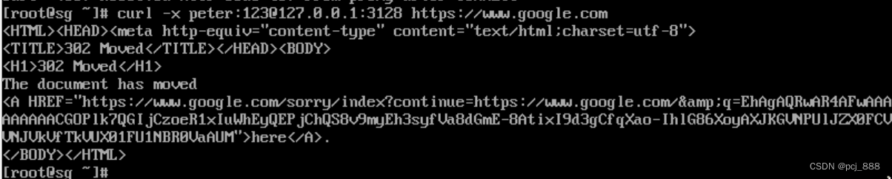

## 问题描述
我在k8s中启动了一个Host网络模式的pod，这个pod的域名解析失败了。

## 定位步骤
敲`kubectl  exec -it [pod_name] -- bash`进入pod后台，查看`/etc/resolv.conf`，发现nameserver配的有问题。**这里我预期的nameserver应该使用宿主机的，但实际上用的是coredns的。**
<!-- more -->


再查看pod的dnsPolicy，发现dns策略为ClusterFirstWithHostNet，这个策略使得Host模式的Pod仍然使用k8s的dns；我需要使用宿主机的dns，所以需要把这个dns策略改为'Default'
```
kubectl -n sg-fps get deploy -o yaml | grep dnsPolicy
        dnsPolicy: ClusterFirstWithHostNet
```

通过`kubectl -n kube-system get cm/coredns -o yaml`查看coredns配置，发现coredns里配置的dnsserver为10.204.16.1，这个IP我也配错了，再加上之前pod里配的策略是ClusterFirstWithHostNet，这两个错误同时出现，导致pod域名解析失败。


## 解决方法
把Pod的dnsPolicy改成Default，k8s的四种DNS策略参考：[link](https://aiops.com/news/post/12763.html)
